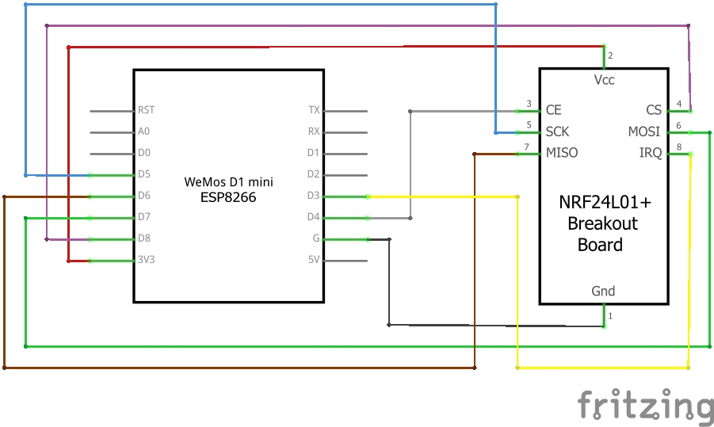
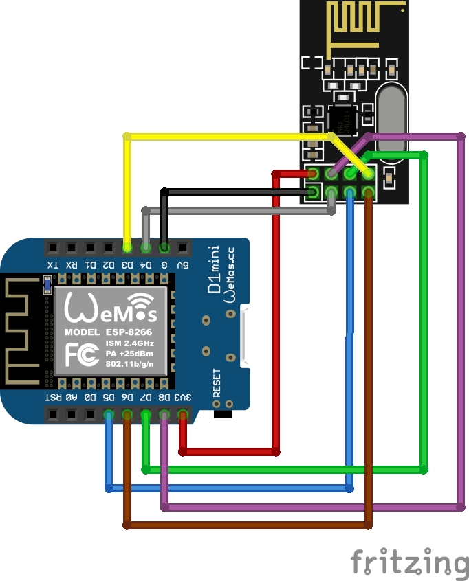
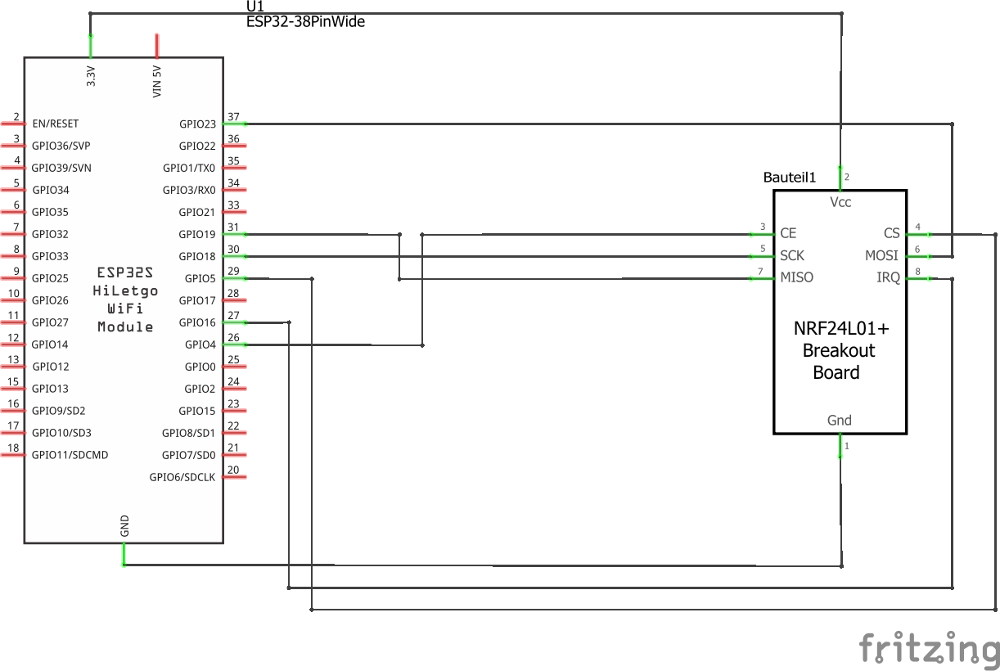
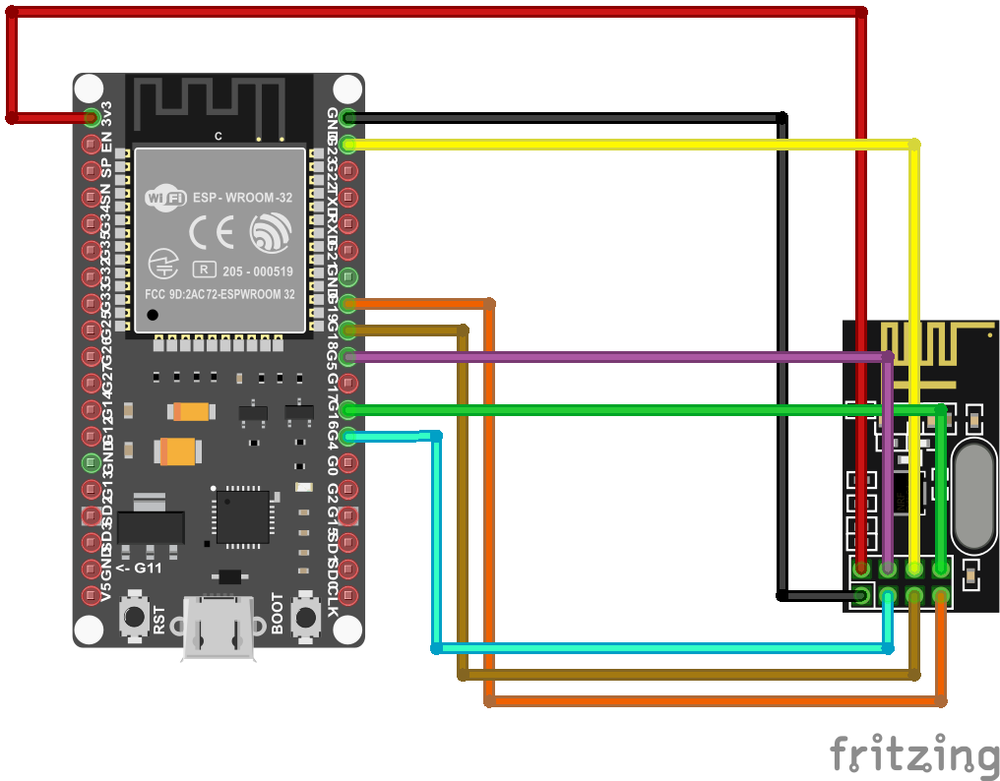

## Table of Contents

- [Table of Contents](#table-of-contents)
- [Overview](#overview)
- [Compatiblity](#compatiblity)
- [Things needed](#things-needed)
    - [There are fake NRF24L01+ Modules out there](#there-are-fake-nrf24l01-modules-out-there)
- [Wiring things up](#wiring-things-up)
    - [ESP8266 wiring example](#esp8266-wiring-example)
      - [Schematic](#schematic)
      - [Symbolic view](#symbolic-view)
    - [ESP32 wiring example](#esp32-wiring-example)
      - [Schematic](#schematic-1)
      - [Symbolic view](#symbolic-view-1)
      - [ESP32 GPIO settings](#esp32-gpio-settings)
- [Flash the Firmware on your Ahoy DTU Hardware](#flash-the-firmware-on-your-ahoy-dtu-hardware)
    - [Compiling your own Version](#compiling-your-own-version)
      - [Optional Configuration before compilation](#optional-configuration-before-compilation)
    - [Using a ready-to-flash binary using nodemcu-pyflasher](#using-a-ready-to-flash-binary-using-nodemcu-pyflasher)
- [Connect to your Ahoy DTU](#connect-to-your-ahoy-dtu)
    - [Your Ahoy DTU is very verbose using the Serial Console](#your-ahoy-dtu-is-very-verbose-using-the-serial-console)
    - [Connect to the Ahoy DTU Webinterface using your Browser](#connect-to-the-ahoy-dtu-webinterface-using-your-browser)
      - [HTTP based Pages](#http-based-pages)
- [MQTT command to set the DTU without webinterface](#mqtt-command-to-set-the-dtu-without-webinterface)
- [Used Libraries](#used-libraries)
- [Contact](#contact)
- [ToDo](#todo)

***

## Overview

This page describes how the module of a Wemos D1 mini and ESP8266 is wired to the radio module and is flashed with the latest Firmware.<br/>
Further information will help you to communicate to the compatible inverters.

You find the full [User_Manual here](User_Manual.md)

## Compatiblity

For now the following Inverters should work out of the box:

Hoymiles Inverters

- HM300
- HM350
- HM400
- HM600
- HM700
- HM800
- HM1000?
- HM1200
- HM1500

TSun Inverters:

- TSOL-350
- TSOL-400
- others may work as well (need to be verified).

## Things needed

In order to build your own Ahoy DTU, you will need some things.<br/>
This list is not closing as the Maker Community offers more Boards than we could cover in this Readme.<br/><br/>

We suggest to use a WEMOS D1 mini Board as well as a NRF24L01+ Breakout Board as a bare minimum.<br/>
Any other ESP8266 Board with at least 4MBytes of ROM could work as well, depending on your skills and goals.<br/>
Make sure the NRF24L01+ module has the "+" in its name as we depend on the 250kbps features provided only with the plus-variant.

| **Parts** | **Price** |
| --- | --- |
| D1 ESP8266 Mini WLAN Board Mikrokontroller | 4,40 Euro |
| NRF24L01+ SMD Modul 2,4 GHz Wi-Fi Funkmodul | 3,45 Euro |
| Jumper Wire Steckbrücken Steckbrett weiblich-weiblich | 2,49 Euro |
| **Total costs** | **10,34 Euro** |

To also run our sister project OpenDTU and be upwards compatible for the future we would recommend to spend some more money on an ESP32 board which has two CPU cores and a NRF24L01+ module with external antenna.

| **Parts** | **Price** |
| --- | --- |
| ESP32 Dev Board NodeMCU WROOM32 WiFi | 7,90 Euro |
| NRF24L01+ PA LNA SMA mit Antenne Long | 4,50 Euro |
| Jumper Wire Steckbrücken Steckbrett weiblich-weiblich | 2,49 Euro |
| **Total costs** | **14,89 Euro** |

#### There are fake NRF24L01+ Modules out there

Watch out, there are some fake NRF24L01+ Modules out there that seem to use rebranded NRF24L01 Chips (without the +).<br/>
An example can be found in [Issue #230](https://github.com/lumapu/ahoy/issues/230).<br/>
You are welcome to add more examples of faked chips. We will add that information here.<br/>

## Wiring things up

The NRF24L01+ radio module is connected to the standard SPI pins:

- SCLK (Signal Clock),
- MISO (Master In Slave Out) and
- MOSI (Master Out Slave In)

*These pins need to be configured in the config.h.*

Additional, there are 3 pins, which can be set individual:

- CS (Chip Select),
- CE (Chip Enable) and
- IRQ (Interrupt)

*These pins can be changed from the /setup URL.*

#### ESP8266 wiring example

This is an example wiring using a Wemos D1 mini.<br>

##### Schematic



##### Symbolic view



#### ESP32 wiring example

Example wiring for a 38pin ESP32 module

##### Schematic



##### Symbolic view



##### ESP32 GPIO settings

For this wiring, set the 3 individual GPIOs under the /setup URL:

```
CS   D1 (GPIO5)
CE   D2 (GPIO4)
IRQ  D0 (GPIO16 - no IRQ!)
```

## Flash the Firmware on your Ahoy DTU Hardware

Once your Hardware is ready to run, you need to flash the Ahoy DTU Firmware to your Board.
You can either build your own using your own configuration or use one of our pre-compiled generic builds.

#### Compiling your own Version

This information suits you if you want to configure and build your own firmware.

This code comes to you as a **PlatformIO** project and can be compiled using the **PlatformIO** Addon.<br/>
Visual Studio Code, AtomIDE and other IDE's support the PlatformIO Addon.<br/>
If you do not want to compile your own build, you can use one of our ready-to-flash binaries.

##### Optional Configuration before compilation

- number of supported inverters (set to 3 by default) `config.h`
- DTU radio id `config.h` (default = 1234567801)
- unformatted list in webbrowser `/livedata` `config.h`, `LIVEDATA_VISUALIZED`

Alternativly, instead of modifying `config.h`, `config_override_example.h` can be copied to `config_override.h` and customized.
config_override.h is excluded from version control and stays local.

#### Using a ready-to-flash binary using nodemcu-pyflasher

This information suits you if you just want to use an easy way.

1. download the flash-tool [nodemcu-pyflasher](https://github.com/marcelstoer/nodemcu-pyflasher)
2. download latest release bin-file from [ahoy_](https://github.com/grindylow/ahoy/releases)
3. open flash-tool and connect the target device to your computer.
4. Set the correct serial port and select the correct *.bin file
5. click on "Flash NodeMCU"
6. flash the ESP with the compiled firmware using the UART pins or
7. repower the ESP
8. the ESP will start as access point (AP) if there is no network config stored in its eeprom
9. connect to the AP (password: `esp_8266`), you will be forwarded to the setup page
10. configure your WiFi settings, save, repower
11. check your router or serial console for the IP address of the module. You can try ping the configured device name as well.
  
Once your Ahoy DTU is running, you can use the Over The Air (OTA) capabilities to update your firmware.

! ATTENTION: If you update from a very low version to the newest, please make sure to wipe all flash data!

## Connect to your Ahoy DTU

When everything is wired up and the firmware is flashed, it is time to connect to your Ahoy DTU.

#### Your Ahoy DTU is very verbose using the Serial Console

 When connected to your computer, you can open a Serial Console to obtain additional information.<br/>
 This might be useful in case of any troubles that might occur as well as to simply<br/>
 obtain information about the converted values which were read out of the inverter(s).

#### Connect to the Ahoy DTU Webinterface using your Browser

 After you have sucessfully flashed and powered your Ahoy DTU, you can access it via your Browser.<br/>
 If your Ahoy DTU was able to log into the configured WiFi Network, it will try to obtain an IP-Address<br/>
 from your local DHCP Server (in most cases thats your Router).<br/><br/>
 In case it could not connect to your configured Network, it will provide its own WiFi Network that you can<br/>
 connect to for furter configuration.<br/>
 The WiFi SSID *(the WiFi Name)* and Passwort is configured in the config.h and defaults to the SSID "`AHOY-DTU`" with the Passwort "`esp_8266`".<br/>
 The Ahoy DTU will keep that Network open for a certain amount of time (also configurable in the config.h and defaults to 60secs).<br/>
 If nothing connects to it and that time runs up, it will retry to connect to the configured network an so on.<br/>
 <br/>
 If connected to your local Network, you just have to find out the used IP Address or try the default name [http://ahoy-dtu/](http://ahoy-dtu/). In most cases your Router will give you a hint.<br/>
 If you connect to the WiFi the Ahoy DTU opens in case it could not connect to any other Network, the IP-Address of your Ahoy DTU is [http://192.168.4.1/](http://192.168.4.1/).<br/>
 Just open the IP-Address in your browser.<br/>
 <br/>
 The webinterface has the following abilities:

- OTA Update (Over The Air Update)
- Configuration (Wifi, inverter(s), NTP Server, Pinout, MQTT, Amplifier Power Level, Debug)
- visual display of the connected inverters / modules
- some statistics about communication (debug)

##### HTTP based Pages

 To take control of your Ahoy DTU, you can directly call one of the following sub-pages (e.g. [http://ahoy-dtu/setup](http://ahoy-dtu/setup) or [http://192.168.4.1/setup](http://192.168.4.1/setup) ).<br/>

| page | use | output | default availability |
| ---- | ------ | ------ | ------ |
| /uptime | displays the uptime uf your Ahoy DTU | 0 Days, 01:37:34; now: 2022-08-21 11:13:53 | yes |
| /reboot | reboots the Ahoy DTU | | yes |
| /erase | erases the EEPROM |    | yes |
| /factory | resets to the factory defaults configured in config.h |    | yes |
| /setup | opens the setup page |    | yes |
| /save | | | yes |
| /cmdstat | show stat from the home page | | yes |
| /visualization | displays the information from your converter |     | yes |
| /livedata | displays the live data |     | yes |
| /json | gets live-data in JSON format | json output from the livedata | no - enable via config_override.h |
| /metrics | gets live-data for prometheus | prometheus metrics from the livedata | no - enable via config_override.h |
| /api | |    |  yes |

## MQTT command to set the DTU without webinterface

[Read here](User_Manual.md)

## Used Libraries

| Name                  | version | License  |
| --------------------- | ------- | -------- |
| `ESP8266WiFi`         | 1.0     | LGPL-2.1 |
| `DNSServer`           | 1.1.1   | LGPL-2.1 |
| `SPI`                 | 1.0     | LGPL-2.1 |
| `Hash`                | 1.0     | LGPL-2.1 |
| `EEPROM`              | 1.0     | LGPL-2.1 |
| `ESP Async WebServer` | 1.2.3   | LGPL-3.0 |
| `ESPAsyncTCP`         | 1.2.2   | LGPL-3.0 |
| `Time`                | 1.6.1   | LGPL-2.1 |
| `RF24`                | 1.4.5   | GPL-2.0  |
| `PubSubClient`        | 2.8     | MIT      |
| `ArduinoJson`         | 6.19.4  | MIT      |

## Contact

We run a Discord Server that can be used to get in touch with the Developers and Users.

<https://discord.gg/WzhxEY62mB>

## ToDo

[See this post](https://github.com/lumapu/ahoy/issues/142)
